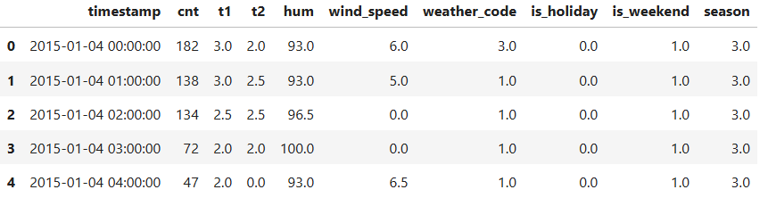
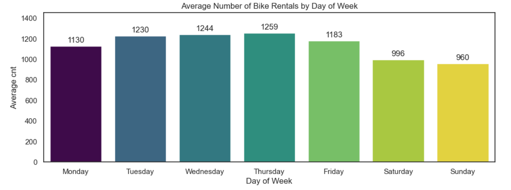
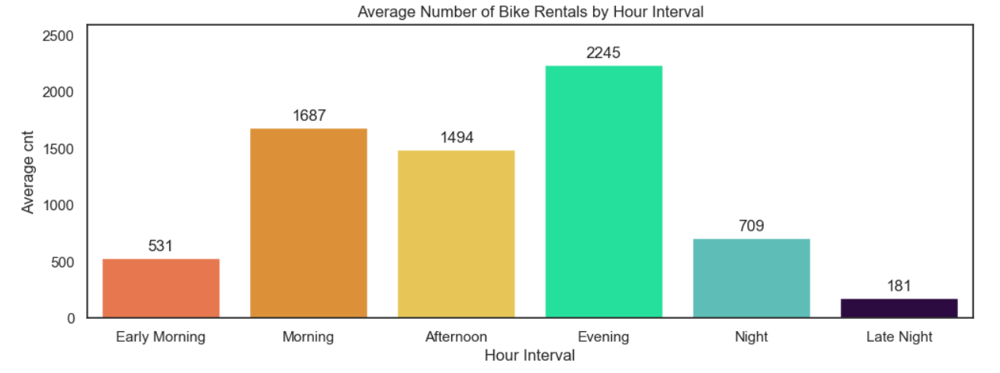
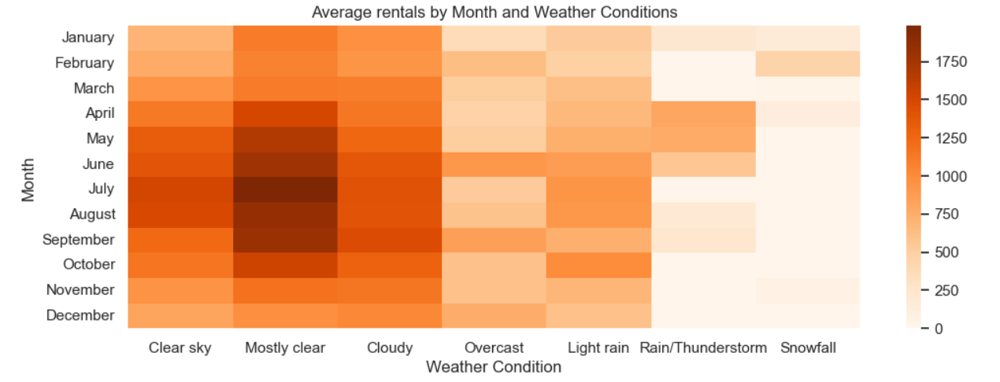

# Bike Rental Analysis

### 

### 🎯 Objective:
In this mini-project, we analyze a bike rental company in London.
Our aim is to explore the dynamics of rental activity, to investigate its relationship with weather conditions and weekends/holidays, and to explain several anomalies seen in the data.

### 📊 Dataset:
**Source:** Educational project dataset  
**Period:** From January 4, 2015 to January 3, 2017  
**Key variables:** Time, number of bike rentals (hourly), holiday / weekend flags, temperature, season, weather conditions  
**Dataset size:** 17,414 rows * 10 columns

### 🛠️ Technologies Used:
Libraries: pandas, numpy, seaborn, matplotlib

### 📁 Repository Structure:
1. bike-rental-analysis.ipynb - working file
2. london.csv - dataset

### 🔍 Analysis Process:
* Conducted preliminary analysis (EDA) and data preprocessing
* Performed Weekday Analysis and Visualized results using seaborn and matplotlib.pyplot
* Performed Hourly Analysis and Visualized results using seaborn and matplotlib.pyplot
* Performed Seasonal vs Weather Conditions Analysis and Visualized results using the heatmap
* Performed a time series analysis to identify anomalies in the rental data  

### 💡 Key Findings:
* The analysis of bike rental data demonstrates that user activity is strongly influenced by weekdays, time of day, weather conditions, and seasonality.
* Rentals are highest and most variable on weekdays, peaking on Thursdays, while weekends show consistently lower and more stable demand.
* The hourly analysis shows the highest activity in the evening (4PM – 8PM), followed by the morning, and minimal activity during late night and early morning hours.
* Seasonal and weather factors also play a significant role: summer months with clear or mostly clear skies see the highest rental numbers, whereas rain, thunderstorms, and snow correspond to lower activity throughout the year.
* An exceptional event, such as a 24-hour London Underground strike, which took place on 2015-07-09, was identified through time series analysis. It generated extreme demand spikes of bike rentals that exceed typical ranges.
* Overall, bike rental demand is shaped by a combination of calendar, temporal, and external factors, with the greatest activity observed on weekdays during busy hours, while extreme values are often linked to unusual events or specific weather conditions.

### 📈 Visualizations:
  

  

  

### 📌 Project Notes:
***This is an educational project for learning data analysis and visualization techniques.***
